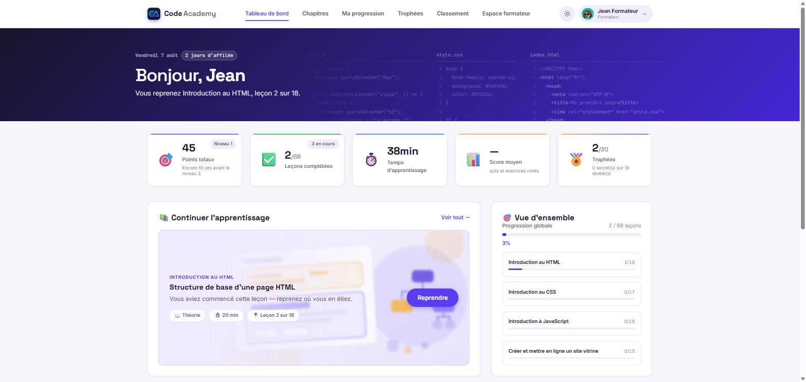
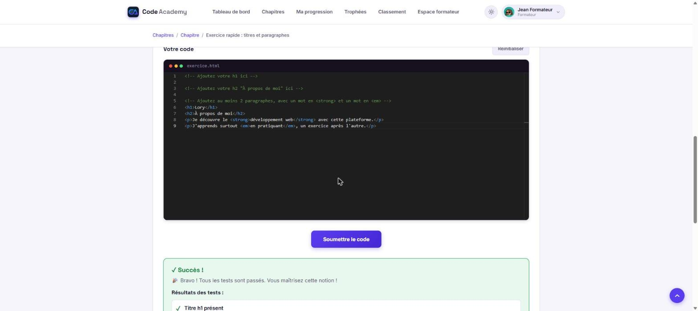
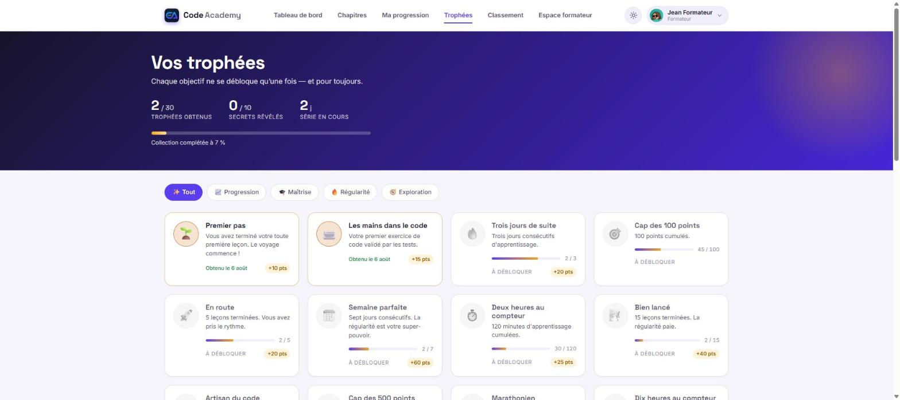
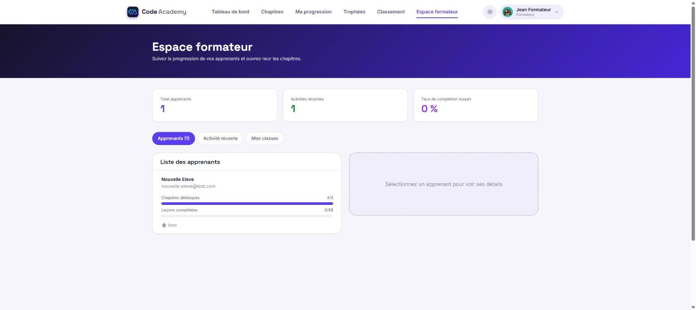

<div align="center">

# CodeAcademy

**Une plateforme d'apprentissage du développement web, du premier `<h1>` à la mise en ligne.**

[](https://github.com/lorycarvajol/appli-learning-1/actions/workflows/ci.yml)
[](https://codelearning.lorycarvajol.dev/login)
[](https://github.com/lorycarvajol/appli-learning-1/commits/main)
[](./LICENSE)

[](https://www.djangoproject.com/)
[](https://www.django-rest-framework.org/)
[](https://react.dev/)
[](https://vite.dev/)
[](https://www.postgresql.org/)
[](https://redis.io/)
[](https://docs.docker.com/compose/)

### 🌐 [codelearning.lorycarvajol.dev](https://codelearning.lorycarvajol.dev/login)

</div>



<div align="center"><i>Le tableau de bord : là où l'on reprend son parcours.
Le bandeau porte trois fichiers ouverts — <code>script.js</code>,
<code>style.css</code>, <code>index.html</code> — les trois premiers chapitres
du parcours.</i></div>

---

## Sommaire

[Aperçu](#aperçu) · [Le parcours](#le-parcours) · [Ce que chacun peut faire](#ce-que-chacun-peut-faire) ·
[Décisions techniques](#décisions-techniques) · [La pile](#la-pile) · [Démarrer](#démarrer-en-local) ·
[Tests](#tests) · [Structure](#structure-du-dépôt) · [Documentation](#documentation) · [Licence](#licence)

---

## Aperçu

Les apprenants suivent un parcours de quatre chapitres, écrivent du vrai code
corrigé automatiquement dans un bac à sable isolé, et progressent à leur
rythme ou au tempo de leur formateur. Les formateurs suivent leur classe et
ouvrent les chapitres. Les administrateurs pilotent les comptes, chaque geste
étant consigné dans un journal que rien ne peut réécrire.

| | |
|---|---|
| **Parcours** | 4 chapitres · 68 leçons · 25 exercices corrigés · 5 quiz |
| **Récompenses** | 30 trophées, dont 10 secrets |
| **Personnalisation** | 42 visages d'avatar, 7 familles · thème clair et sombre |
| **Illustrations** | 31 figures de cours · 4 illustrations de leçon |
| **Application** | 7 apps Django · 13 features React · 20 routes |
| **Tests** | 332 backend · 146 frontend · 11 bout-en-bout |

---

## Le parcours

| # | Chapitre | Leçons | Exercices | Quiz |
|---|---|:---:|:---:|:---:|
| 1 | Introduction au HTML | 18 | 8 | 2 |
| 2 | Introduction au CSS | 17 | 8 | 1 |
| 3 | Introduction à JavaScript | 18 | 9 | 1 |
| 4 | Créer et mettre en ligne un site vitrine | 15 | — | 1 |

Le contenu pédagogique **ne vit pas en base de données** : il vit dans le code,
sous `backend/apps/courses/content/`. La base n'en est qu'une projection,
reconstructible à tout moment par une commande. C'est ce qui a permis de
récupérer deux incidents sans perdre une ligne.

---

## Ce que chacun peut faire

### 🎓 Apprenant

Lire les leçons — validées **à la lecture**, pas par un bouton à cocher.
Écrire du code dans un éditeur Monaco, soumis à des tests qui s'exécutent
dans un bac à sable isolé. Passer des quiz. Gagner des points, des niveaux et
des trophées. Se comparer aux autres, ou s'en retirer d'un clic. Exporter
toutes ses données, ou supprimer son compte, sans passer par personne.



> Le code part dans un conteneur jetable, sans réseau. Chaque critère est
> vérifié séparément et le retour dit **quoi corriger**, pas seulement que
> c'est faux.



> Les objectifs visibles balisent le parcours avec leur barre de progression.
> Les secrets ne montrent qu'une énigme — et le masquage se fait **côté
> serveur** : impossible de les découvrir en inspectant les requêtes réseau.

### 👩‍🏫 Formateur

Créer des classes et inviter par lien — aucun envoi d'e-mail requis. Suivre
la progression de ses apprenants, leçon par leçon. Ouvrir les chapitres au
rythme qu'il choisit. Il ne voit **que ses propres classes**.



### 🛠️ Administrateur

Piloter les comptes (rôle, activation, anonymisation RGPD, affectation de
classe), le tout **tracé dans un journal d'audit** que rien ne peut réécrire.
Le CRUD de contenu reste dans l'admin Django, qui le fait mieux.

---

## Décisions techniques

Le projet documente ses choix plutôt que ses fonctionnalités. Quelques-uns
valent d'être lus :

<table>
<tr><td width="34%"><b>Rien n'est récompensé deux fois</b></td>
<td>Garanti non par du code prudent mais par trois mécanismes cumulés : des
contraintes d'unicité en base, des règles monotones, et un grand livre où le
solde égale toujours la somme des transactions. La réconciliation peut donc
être relancée n'importe quand.</td></tr>

<tr><td><b>Le conteneur est la seule frontière</b></td>
<td>La liste noire de motifs a été retirée : elle refusait du code légitime
(<code>evaluer</code> déclenchait sur <code>eval</code>) sans arrêter le
moindre contournement. Le conteneur, lui, est sans réseau, non privilégié,
sans capacité, en lecture seule — et le worker ne voit le démon Docker qu'à
travers un mandataire limité aux routes du bac à sable.</td></tr>

<tr><td><b>Aucun traceur, donc aucune bannière</b></td>
<td>Avatars pré-générés à la construction, polices et images servies par la
plateforme. Aucune requête ne part chez un tiers — c'est ce qui rend la
politique de confidentialité tenable.</td></tr>

<tr><td><b>Anonymisation, jamais suppression</b></td>
<td>Effacer un compte fausserait rétroactivement les statistiques de sa
classe. L'identité part, la progression reste, rattachée à un compte qui ne
désigne plus personne.</td></tr>

<tr><td><b>On ne reverrouille jamais</b></td>
<td>Un chapitre ouvert le reste, qu'on rejoigne une classe ensuite ou qu'on la
quitte.</td></tr>
</table>

Le raisonnement complet — y compris les erreurs commises et ce qu'elles ont
coûté — est dans [`CLAUDE.md`](./CLAUDE.md).

---

## La pile

| | |
|---|---|
| **Backend** | Django 5.2 · Django REST Framework · SimpleJWT · Celery · PostgreSQL 15 · Redis 7 |
| **Frontend** | React 18 · Vite 5 · Redux Toolkit · React Router 7 · Monaco Editor |
| **Style** | SCSS maison, BEM, tokens de thème — **aucun framework CSS** |
| **Exécution de code** | Conteneurs Docker jetables, pilotés par Celery via un mandataire de socket |
| **Production** | Docker Compose · Traefik · Let's Encrypt · WhiteNoise |

---

## Démarrer en local

```bash
docker compose up -d

docker compose exec backend python manage.py load_course_content   # le parcours
docker compose exec backend python manage.py seed_badges           # les trophées
docker compose exec backend python manage.py create_demo_users     # comptes de dev
```

Puis [localhost:5173](http://localhost:5173) et
[localhost:8000/admin](http://localhost:8000/admin/).

> [!NOTE]
> **Tout passe par Docker.** Seul `npm` s'utilise en local, côté front — le
> conteneur est en Node 18, la CI et les tests en Node 22.

> [!WARNING]
> `create_demo_users` **refuse de s'exécuter en production** : ses mots de
> passe sont écrits dans le dépôt.

---

## Tests

```bash
docker compose exec backend pytest          # 332 tests
docker compose exec celery pytest -m docker # + 7 tests du bac à sable réel

cd frontend && npm test                     # 146 tests
cd frontend && npm run e2e                  # 11 tests Playwright (pile requise)
```

Les tests sont **validés par sabotage** : on casse volontairement le code pour
vérifier que le test rougit. Un test vert sur du code cassé ne protège rien.

La CI ([`ci.yml`](.github/workflows/ci.yml)) joue à chaque *pull request* et
sur `main` : migrations manquantes, migrations sur base vierge, contrôles
Django, pytest — puis ESLint (`--max-warnings 0`), Vitest et le *build*.

---

## Structure du dépôt

```
backend/
  apps/          accounts · administration · cohorts · courses
                 gamification · progression · validation
  config/        settings/{base,development,production}.py
frontend/
  src/features/  auth · chapters · cohorts · dashboard · errors · exercises
                 gamification · legal · profile · progression · quizzes · trainer
  src/styles/    design system SCSS
scripts/         sauvegarde et restauration PostgreSQL
docker-compose.prod.yml
```

---

## Documentation

| Fichier | Pour quoi |
|---|---|
| [**CLAUDE.md**](./CLAUDE.md) | **L'essentiel.** État du projet, décisions, pièges et leur histoire |
| [06_ROADMAP_DEPLOIEMENT.md](./06_ROADMAP_DEPLOIEMENT.md) | Mise en production : procédure, contrôles d'ouverture, répétitions |
| [04_ARCHITECTURE_TECHNIQUE.md](./04_ARCHITECTURE_TECHNIQUE.md) | Architecture détaillée |
| [02_USER_STORY_MAPPING.md](./02_USER_STORY_MAPPING.md) | User stories des trois rôles |
| [03_DIAGRAMMES_UML.md](./03_DIAGRAMMES_UML.md) | Diagrammes UML |
| [01_ROADMAP.md](./01_ROADMAP.md) | Roadmap produit d'origine |

---

## Ce qui n'existe pas encore

Dit franchement, parce qu'une documentation qui promet ce qui n'est pas
construit fait perdre plus de temps qu'elle n'en fait gagner :

- **Temps réel / WebSockets** — `asgi.py` a un routeur vide, aucun consumer.
  Rien n'en dépend : l'auto-sauvegarde, l'activité formateur et les
  notifications passent par HTTP.
- **Forum** — l'app n'existe pas.
- **Soumission de projets** — le modèle `Project` existe, aucun modèle de
  soumission.

---

## Licence

Ce projet est distribué sous **[GNU Affero General Public License v3.0](./LICENSE)**.

Vous pouvez lire, modifier et redéployer ce code. En contrepartie, la licence
impose une chose : **si vous déployez une version modifiée et que des
utilisateurs s'en servent à travers le réseau, vous devez publier votre code
source** — même sans distribuer le moindre fichier. C'est ce que dit la
section 13, et c'est la raison d'être de l'AGPL par rapport à la GPL, écrite
avant que le logiciel ne se consomme depuis un navigateur.

> [!NOTE]
> C'est aussi pourquoi le pied de page de l'application renvoie vers ce
> dépôt : pour une application déployée, un fichier `LICENSE` ne suffit pas à
> satisfaire la section 13 — l'offre de source doit être atteignable depuis
> l'application elle-même.

La licence couvre le **code**. Les visages d'avatar gardent la leur (voir
ci-dessous), et l'attribution CC BY 4.0 qu'ils imposent reste due
indépendamment de l'AGPL.

Copyright © 2026 Lory Carvajol.

---

## Crédits

Visages d'avatar issus de [DiceBear](https://www.dicebear.com/) :
*Notionists* (Zoish, CC0 1.0) · *Adventurer* et *Adventurer Neutral*
(Lisa Wischofsky, CC BY 4.0) · *Avataaars* et *Bottts* (Pablo Stanley) ·
*Big Smile* (Ashley Seo, CC BY 4.0) · *ToonHead* (Johan Melin, CC BY 4.0).
Ils sont générés à la construction et servis par la plateforme — aucune
requête vers un tiers.

<div align="center">

Édité par **Lory Carvajol** · `lorycarvajol.dev`

</div>
